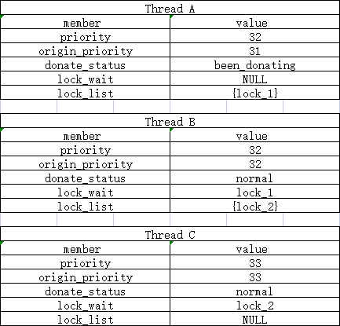

<center><font size=5>+-----------------------------------+</font></center>
<center><font size=5>|------------ CS-130 ------------|</font></center>
<center><font size=5>|--PROJECT1--THREADS--|</font></center>
<center><font size=5>|---DESIGN-DOCUMENT---|</font></center>
<center><font size=5>+-----------------------------------+</font></center>

### GROUP

> Fill in the names and email addresses of your group members.

Yifan Zhu <zhuyf1@shanghaitech.edu.cn>  
Zongze Li <lizz@shanghaitech.edu.cn>


### PRELIMINARIES

> If you have any preliminary comments on your submission, notes for the
> TAs, or extra credit, please give them here.

> Please cite any offline or online sources you consulted while
> preparing your submission, other than the Pintos documentation, course
> text, lecture notes, and course staff.
>
> * Synchronization
>
>   https://www.cnblogs.com/549294286/p/3687678.html
>
> *  Interrupt
>
>    https://www.jianshu.com/p/eac05373f30f
>
> * Yield
>
>   https://blog.csdn.net/y532798113/article/details/103997066
>
> * Lock
>
>   https://blog.csdn.net/weixin_44277699/article/details/117117911
>
> * Semaphore
>
>   https://blog.csdn.net/leikun153/article/details/81515186
>


<center><font size=5>ALARM CLOCK</font></center>

### DATA STRUCTURES

> A1: Copy here the declaration of each new or changed `struct` or
> `struct` member, global or static variable, `typedef`, or
> enumeration.  Identify the purpose of each in 25 words or less.

 Add to struct thread :

 ​	int thread_sleep : To record the ticks thread will sleep until equal to 0

### ALGORITHMS

> A2: Briefly describe what happens in a call to timer_sleep(),
> including the effects of the timer interrupt handler.

 Set the specific sleep ticks to the current thread and disable interrupts, then block current thread and put it into blocked list, finally reschedule and recover interrupt level.

 For interrupt handler, it always check the sleep list to assess whether need to wake some thread, if need, then reset it's sleep tick and disable interrupts, remove it from block list and wake it, finally recover interrupt level. If needn't, just cut down one tick for each time.

> A3: What steps are taken to minimize the amount of time spent in
> the timer interrupt handler?

In our timer_interrupt function, we use thread_foreach() functiion iterate every thread in the block list, so the critical factor to minimize cost is maintain an ordered queue rather than pushing back directly. So we use the list_insert_ordered() function, each element will be inserted to a right position at first time. Obviously, each unblock_thread just cost O(1) in place of random insert with O(n).

### SYNCHRONIZATION

> A4: How are race conditions avoided when multiple threads call
> timer_sleep() simultaneously?

 For this part, the critical section is manipulate the list. In fact, every list operation must happen during disabled interrupt status.

> A5: How are race conditions avoided when a timer interrupt occurs
> during a call to timer_sleep()?

 Inside the function, we set the status of interrupt to disabled manually to avoid race condition.

### RATIONALE

> A6: Why did you choose this design?  In what ways is it superior to
> another design you considered?

 The main purpose of this task is avoid busy waiting. So we just need to set the specific ticks of sleeping and block the thread in the given ticks rather than assess it circularly. It's a very straight thought about it as to the sleep list. Also it's easy to complement and safe.

 If we want to pursue higher performance, we can complement the sleep list to a "ordered list". In this way we will have no need to iterate the list all the time. We can stop iterate so long as one element's sleep ticks larger than current thread's. That will cut down the cost of CPU and remain right.  

<center><font size=5>PRIORITY SCHEDULING</font></center>

### DATA STRUCTURES

> B1: Copy here the declaration of each new or changed `struct` or
> `struct` member, global or static variable, `typedef`, or
> enumeration.  Identify the purpose of each in 25 words or less.

 ```C
enum donate_status : Represent the donate status in a thread's life cycle.

  {

   been_donating,           /* The thread is being donated */

   normal                   /* The thread isn't being donated */

  };
```

 Add to struct thread :

-  ​	enum donate_status donate_s : Represent the donate status of the thread.

-  ​	int origin_priority : Record the original priority of the thread.

-  ​	struct lock *lock_wait : Record the lock the thread is waiting.

-  ​	struct list lock_list : Record locks in a list which the thread is holding.

 Add to struct lock :

-  ​	struct list_elem elem : Lock itself as a list element.

-  ​	int MAX : Record the max priority in the donate list of the lock

> B2: Explain the data structure used to track priority donation.
> Use ASCII art to diagram a nested donation.  (Alternately, submit a
> .png file.)
>
 In struct thread :

-  ​	we init donate_status to normal, once appear donate action, we set it to been_donating. we use it help to assess update paocess.

- ​	    we init origin_priority as same as prority, donate action just affect thread's priority rather than origin_priority. we use it to recover the thread's priority when donating end.

-  ​	we init lock_wait to NULL, once the thread need the occupied lock, record it. we use it to help iterate to update chain priority donate action.

-  ​	we init lock_list with lock_init(), if thread acquire a lock successfully.we put it in the list. we use it to assess whether to process donate action.

 In struct lock :

-  ​	we use list_elem to index the element in lock_list.

-  ​	we init MAX to 0. If we will process donating action. we will use it to compare with current thread priority. Each time get the bigger one and record. According to it, we can figure out whether we need to donate or when to stop in the chain donate action.

 

 The following is a specific example:  

 Assume :

 A thread, priority 31, has lock lock_1.

 B thread, priority 32, has lock lock_2, and acquire lock_1.

 C thread, priority 33, acquire lock_2.

 

 - 1. At beginning :

<div align=center></div>

 - 2. B acquires Lock_1 :

<div align=center></div>

 - 3. C acquires Lock_2 :

<div align=center></div>

 - 4. A releases Lock_1 :

<div align=center></div>

 - 5. B releases Lock_2 :

<div align=center></div>


### ALGORITHMS

> B3: How do you ensure that the highest priority thread waiting for
> a lock, semaphore, or condition variable wakes up first?

 Maintain the ordered queue of waiting list. And if w need to wake a thread which is blocking, pop front from the waiting list. In this way can let us pop the highest priority holder all the time.(Using the function : list_insert_ordered or list_sort)

> B4: Describe the sequence of events when a call to lock_acquire()
> causes a priority donation.  How is nested donation handled?

 Event sequence :

- 1. Disable interrupts

- 2. Donation

    ( For depict it with no ambiguity, we write it, we use Pseudocode TYPE to show the nested condition relationship )
```C
    If (lock holder is NULL)

    ​	{	

    ​	      sema_down directly. 

    ​	      If sema value is positive, just cut down 1.

    ​         Else if sema value is 0, 
             put all threads acquiring this lock into the sema’s waiters 
             list until sema value becomes positive. 

    ​	    Set current thread->lock_wait with NULL and update lock->MAX

    ​	    Set the lock's holder with current thread.

    ​	}

    Else (lock holder isn't NULL)

    ​	{

    ​	Compare lock_holder’s priority with current thread’s priority.

    ​	If (lock_holder’s priority > current thread’s priority)

    ​		{

    ​		sema_down directly.

    ​	     If sema value is positive, just cut down 1.

    ​	     Else if sema value is 0, 
             put all threads acquiring this lock into the sema’s waiters
             list until sema value becomes positive.

    ​		Set current thread->lock_wait with NULL and update lock->MAX

    ​		Set the lock's holder with current thread.

    ​		}

    ​	Else (lock_holder’s priority < current thread’s priority)

    ​	    {

    ​		 Donate.

    ​		  Set lock_holder’s priority priority with current thread’s priority

    ​		  Set the holder's donate status with been_donating

    ​		sema_down directly.

    ​		 If sema value is positive, just cut down 1.

    ​		 Else if sema value is 0, 
                 put all threads acquiring this lock into the sema’s waiters 
                 list until sema value becomes positive.

    ​		    Set current thread->lock_wait with NULL and update lock->MAX

    ​		    Set the lock's holder with current thread.

    ​		}

    ​	}
```
- 3. Reset the interrupt status before it was disabled


 For the nested donation.

 First step is same as upper part. And assess whether the lock_wait is NULL. If false, that means the current lock holder is blocked by another lock, we need to iterate to update the priority.

 Just using the lock_wait to access the holder 's wait. And do the same process to the "lock_wait" until lock_wait become to NULL(means no wait lock).After this process, all locks holders have the same priority as the thread which acquires the first lock.


> B5: Describe the sequence of events when lock_release() is called
> on a lock that a higher-priority thread is waiting for.

 Event sequence :

- 1. Disable interrupts

- 2. Release 

    ( For depict it with no ambiguity, we write it, we use Pseudocode TYPE to show the nested condition relationship )

    First remove corresponding lock element and resort lock_list

    Then update the priority of lock holder. 
```C
    ​		If(current thread hold no lock)

    ​		{

    ​			Reset it's original priority to priority directly.

    ​			Change it's donate status to normal.

    ​		}

    ​		Else

    ​		{

    ​			Get the front element from the waiting queue.

    ​			If(MAX > current thread's original priority)

    ​			{

    ​				Using the MAX value update current's priority.

    ​				Change it's donate status to normal.

    ​			}  

    ​			Else(MAX < current thread's original priority)

    ​			{

    ​				Reset it's original priority to priority directly.

    ​				Change it's donate status to normal.

    ​			}

    ​		}
```


Finally set the lock holder to NULL and sema_up dircetly.
    ​		Increase sema value by 1.

- 3. Set lock's holder with NULL and reset the interrupt status before it was disabled

### SYNCHRONIZATION

> B6: Describe a potential race in thread_set_priority() and explain
> how your implementation avoids it.  Can you use a lock to avoid
> this race?

 If a thread is being donated, at the same time, it is being set_priority(). It's a potential race because the final priority may be different due to different order with running.

 In our complement, we use the interrupt disable to avoid it. Change it's an atomic manipulation.

 And we can't use lock to avoid it unless we add another lock element to the thread structure(Provide interface) 

### RATIONALE

> B7: Why did you choose this design?  In what ways is it superior to
> another design you considered?

 We analyze the test file and construct solution accordingly. Since the priority operation involving : direct donate, nest donate, chain donate, semaphore and lock mix donate, also we sometimes need to recover it(Reversible process). So it obvious we should record every thread's primitive priority. Referring to lock , we also need to record the lock list for each thread and update priority in suitable time.

 Decide the structure we need, next important part is order priority. It's a easy part, just like mission 1 we can directly use list_insert_ordered or list_sort to achieve a priority queue. When we need to pop, just pop front from it is ok.

 Finally, mention the detail such as interact with set_priority(), judge critical conditions... It's a coherent process.

 For the better revise, we may not need to store the thread donate_status. It can be assessed by lock_wait list status easily. Although small, it's save some space.

<center><font size=5>ADVANCED SCHEDULER</font></center>

### DATA STRUCTURES

> C1: Copy here the declaration of each new or changed `struct` or
> `struct` member, global or static variable, `typedef`, or
> enumeration.  Identify the purpose of each in 25 words or less.

myfloat.h :  
`typedef int myfloat` : A new variable type is defined to represent floating point numbers.  
thread.h :  
`int nice` : Each thread is given a property to record the nice value.  
`myfloat r_cpu` : Each thread is given an property that records its recent time in the CPU.  
thread.c :  
`static myfloat l_avg` : The global variable l_load estimates the average number of threads ready to run over the past minute.  

### ALGORITHMS

> C2: Suppose threads A, B, and C have nice values 0, 1, and 2.  Each
> has a recent_cpu value of 0.  Fill in the table below showing the
> scheduling decision and the priority and recent_cpu values for each
> thread after each given number of timer ticks:

|timer|recent_cpu|recent_cpu|recent_cpu|priority|priority|priority|thread|
|-----|----------|----------|----------|--------|--------|--------|------|
ticks |A         |B         |C         |A       |B       |C       |to run|
|0|0|0|0|63|61|59|A|
|4|4|0|0|62|61|59|A|
|8|8|0|0|61|61|59|B|
|12|8|4|0|61|60|59|A|
|16|12|4|0|60|60|59|B|
|20|12|8|0|60|59|59|A|
|24|16|8|0|59|59|59|C|
|28|16|8|4|59|59|58|B|
|32|16|12|4|59|58|58|A|
|36|20|12|4|58|58|58|C|

> C3: Did any ambiguities in the scheduler specification make values
> in the table uncertain?  If so, what rule did you use to resolve
> them?  Does this match the behavior of your scheduler?

Yes, if the priorities of the threads are the same, there will be ambiguity about the running of the threads.  
My rule is ：If the same priority occurs, compare recent_cpu and select the thread with the smallest recent_cpu to run.  
Yes, it match the behavior of my scheduler.

> C4: How is the way you divided the cost of scheduling between code
> inside and outside interrupt context likely to affect performance?

If timer interrupt spends to much time to work, it will take most of ticks by timer interrupt before enforced preemption. This will result in insufficient runtime for this thread. This will cause it to take longer CPU time and raise its load_avg, recent_cpu, then the priority is lowered. To sum up, if the cost of the interrupt context goes up, it will lower performance.

### RATIONALE

> C5: Briefly critique your design, pointing out advantages and
> disadvantages in your design choices.  If you were to have extra
> time to work on this part of the project, how might you choose to
> refine or improve your design?

Advantages :  
1. Some of the functions defined by the project(`thread_foreach()`) are used, which simplifies code line text.  
2. Some functions are defined to encapsulate the code. This improves the readability of the code.  

Disadvantages :  
1. Some code reoccurs that can be encapsulated. This makes parts of the code seem verbose.  
2. Macro definition in `myfloat.h` is not the best way to write, not clever use of bit operations to simplify, resulting in low efficiency.  
3. No assert is used in the code to determine the criteria.  

Improve my code :  
1. Use encapsulation to keep my code clean and concise.  
2. Improve the macro definition in `myfloat.h` by bit operation to improve the operation efficiency.  
3. Use assertions to validate variable values in different parts of code.  

> C6: The assignment explains arithmetic for fixed-point math in
> detail, but it leaves it open to you to implement it.  Why did you
> decide to implement it the way you did?  If you created an
> abstraction layer for fixed-point math, that is, an abstract data
> type and/or a set of functions or macros to manipulate fixed-point
> numbers, why did you do so?  If not, why not?

I implemented the related algorithm of fixed-point in file `myfloat.h`, implementing these algorithms as macros in header files is much simpler than implementing them as functions. And I defined type in the header: `typedef int myfloat`, this gives a better representation of decimals and is consistent with normal usage of types. On the other hand, macro definitions are much more efficient than functions, especially now that each part of the class does only a small part of the work.

<center><font size=5>SURVEY QUESTIONS</font></center>

Answering these questions is optional, but it will help us improve the
course in future quarters.  Feel free to tell us anything you
want--these questions are just to spur your thoughts.  You may also
choose to respond anonymously in the course evaluations at the end of
the quarter.

> In your opinion, was this assignment, or any one of the three problems
> in it, too easy or too hard?  Did it take too long or too little time?

Too hard!!! It takes too long time!!!

> Did you find that working on a particular part of the assignment gave
> you greater insight into some aspect of OS design?

Yes.

> Is there some particular fact or hint we should give students in
> future quarters to help them solve the problems?  Conversely, did you
> find any of our guidance to be misleading?

Good.

> Do you have any suggestions for the TAs to more effectively assist
> students, either for future quarters or the remaining projects?

No.

> Any other comments?